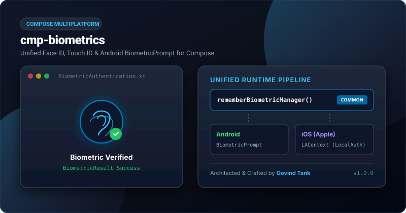

# cmp-biometrics

<p align="center">
  <a href="https://jitpack.io/#govindtank/cmp-biometrics"></a>
  <a href="https://github.com/govindtank/cmp-biometrics/actions"></a>
  
  
  <a href="LICENSE"></a>
</p>

<p align="center">
  <b>Unified Face ID, Touch ID, and Android BiometricPrompt for Compose Multiplatform.</b>
</p>

<p align="center">
  
</p>

---

## ⚡ Why `cmp-biometrics`?

Handling biometric authentication across Android and iOS in Compose Multiplatform previously required cumbersome platform channel bridges, disparate callbacks, and tedious lifecycle management:

- 📱 **Android**: Requires bridging `androidx.biometric.BiometricPrompt`, `FragmentActivity` references, and handling subtle API 28/29/30+ hardware variations.
- 🍏 **iOS**: Requires configuring `LocalAuthentication` `LAContext`, dealing with Objective-C blocks, and handling error codes like `LAErrorUserCancel` vs `LAErrorBiometryLockout`.

`cmp-biometrics` abstracts all platform quirks into **one idiomatic Kotlin Compose API**:
- 🔒 **Biometric Detection**: Queries hardware type (`FACE`, `FINGERPRINT`, `IRIS`, `MULTIPLE`).
- 🛡️ **Device Credential Fallback**: Optional fallback to PIN/Pattern/Passcode.
- 🚀 **Suspend & Callback APIs**: Native coroutines with `BiometricResult` sealed classes.
- 🪶 **Zero Unnecessary Dependencies**: Pure Kotlin Multiplatform + AndroidX Biometric + iOS LocalAuthentication.

---

## 📦 Installation

Add the JitPack repository and dependency to your `build.gradle.kts`:

```kotlin
repositories {
    maven { url = uri("https://jitpack.io") }
}

dependencies {
    implementation("com.github.govindtank:cmp-biometrics:1.0.0")
}
```

---

## 🚀 Quick Start

### 1. Android Initialization (`MainActivity.kt`)

Initialize the biometric context inside your activity's `onCreate`:

```kotlin
import android.os.Bundle
import androidx.activity.ComponentActivity
import androidx.activity.compose.setContent
import io.github.govindtank.biometrics.biometricInit

class MainActivity : ComponentActivity() {
    override fun onCreate(savedInstanceState: Bundle?) {
        super.onCreate(savedInstanceState)
        
        // Initialize once with Activity context
        biometricInit(this)

        setContent {
            App()
        }
    }
}
```

### 2. Compose UI Usage

```kotlin
import androidx.compose.material3.*
import androidx.compose.runtime.*
import io.github.govindtank.biometrics.*

@Composable
fun SecureVaultScreen() {
    val biometricManager = rememberBiometricManager()
    var statusText by remember { mutableStateOf("Tap button to authenticate") }

    Button(onClick = {
        val availability = biometricManager.checkAvailability()
        if (availability == BiometricAvailability.AVAILABLE) {
            biometricManager.authenticate(
                BiometricPromptConfig(
                    title = "Unlock Secure Vault",
                    subtitle = "Verify your identity to proceed",
                    description = "Use Face ID or Fingerprint to unlock your credentials.",
                    negativeButtonText = "Cancel",
                    allowDeviceCredential = true // Allows PIN/Passcode fallback
                )
            ) { result ->
                statusText = when (result) {
                    is BiometricResult.Success -> "Unlocked Successfully! 🎉"
                    is BiometricResult.UserCanceled -> "Authentication cancelled by user."
                    is BiometricResult.Lockout -> "Temporary lockout due to too many attempts."
                    is BiometricResult.NotAvailable -> "Biometric hardware not available."
                    is BiometricResult.Error -> "Error: ${result.message}"
                    is BiometricResult.Failed -> "Authentication failed. Try again."
                }
            }
        } else {
            statusText = "Biometrics unavailable: $availability"
        }
    }) {
        Text("Authenticate with Biometrics")
    }

    Text(statusText)
}
```

---

## 📱 Platform Hardware Support Matrix

| Platform | Native Mechanism | Supported Hardware & Fallbacks |
| :--- | :--- | :--- |
| **Android** | `androidx.biometric.BiometricPrompt` | Fingerprint, Face Unlock, Iris Scan, PIN / Pattern / Password |
| **iOS** | `LocalAuthentication.framework` (LAContext) | Face ID, Touch ID, Optic ID (Apple Vision), Device Passcode |

---

## 🛠️ iOS Configuration

Add `NSFaceIDUsageDescription` to your iOS app's `Info.plist`:

```xml
<key>NSFaceIDUsageDescription</key>
<string>We use Face ID to authenticate and secure your personal account.</string>
```

---

## 💖 Support the Project

If you find this library useful, consider supporting its continuous maintenance and future development:

<p align="left">
  <a href="https://buymeacoffee.com/govindtanko"></a>
  &nbsp;
  <a href="https://github.com/sponsors/govindtank"></a>
  &nbsp;
  <a href="https://www.patreon.com/govindtank"></a>
</p>

---

## 📄 License

This project is licensed under the Apache License 2.0 - see the [LICENSE](LICENSE) file for details.

*Maintained with ❤️ by [Govind Tank](https://github.com/govindtank).*
